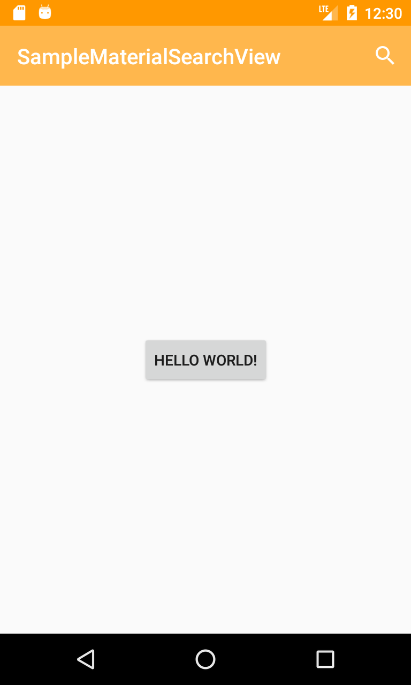
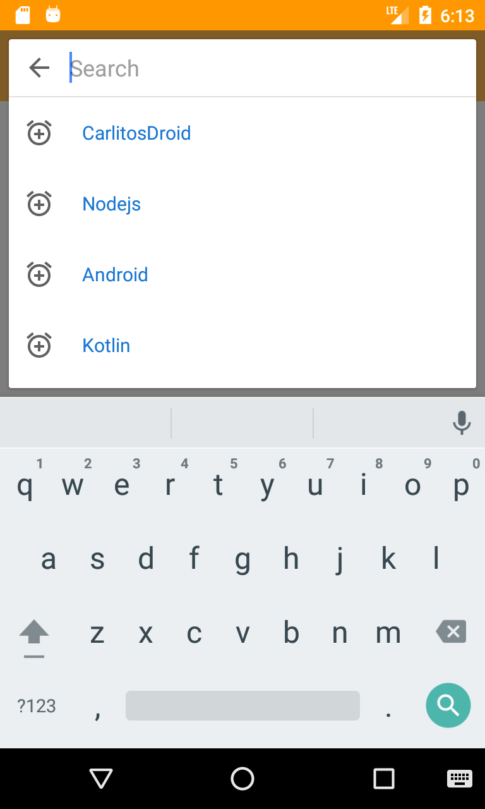
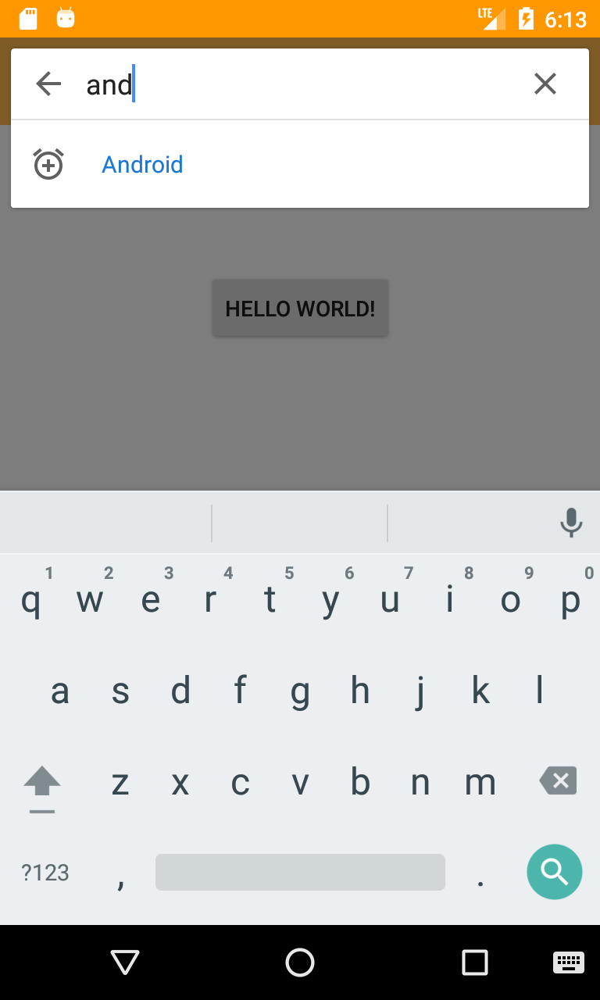
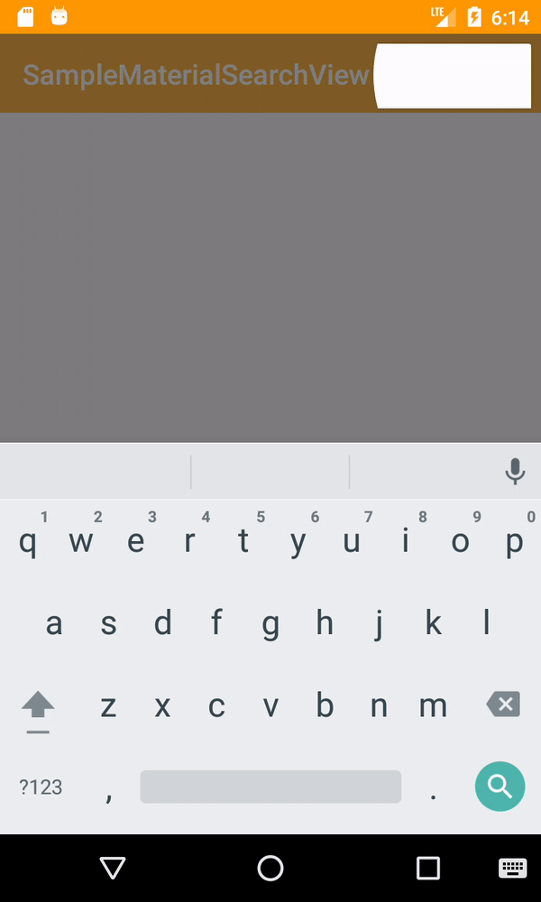

<h1 align="center">MaterialSearchView Widget</h1>

    

MaterialSearchView is a custom widget with a material style that allows you to make any search on 
any custom recyclerview in any activity.

# SearchAdapter class
For using `MaterialSearchView` widget , you must have to extend the `SearchAdapter` class for any adapter. 

    
    
    

#

# Help me
Pull requests are more than welcome, help me and others improve this awesome library.
The code is based in the Google Play Store application concept.